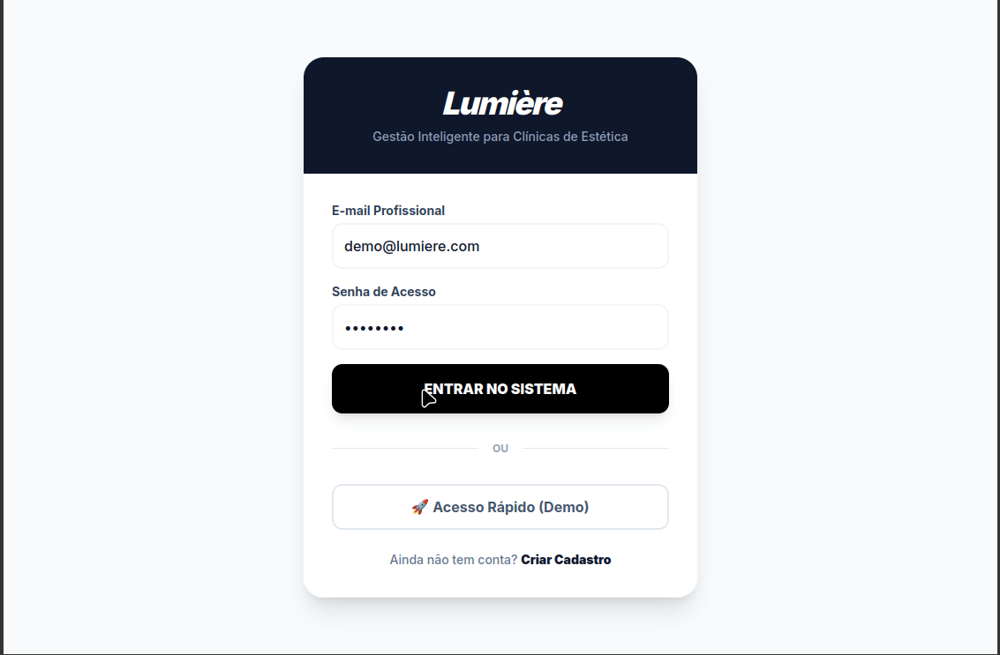

# 💡 Lumière | Gestão de Elite para Estética

**A inteligência que faltava para transformar cliques em conexões e agendamentos em sucesso.**



---

## 🔗 Experimente agora
O Lumière já está em operação na nuvem. Acesse o painel de elite através do link abaixo:

👉 **[Lumière Online - Testar Demo](https://lumiere-ten-vert.vercel.app/login)**

---

## 💎 O Projeto
O Lumière não é apenas um gerenciador de horários; é um ecossistema **Fullstack** pensado para o mercado de luxo da estética. Com uma interface minimalista (Lumière Design System), o sistema organiza clientes, automatiza agendamentos e utiliza Inteligência Artificial para análise de produtividade.

### 🔄 Fluxograma do Sistema
```text
[Cliente/Visitante] --> [Login Profissional]
      |                        |
      V                        V
[Cadastro de Clientes] <--> [Painel de Agendamentos]
      |                        |
      +------> [Lumière AI] <------+
                  |
          (Insights e Resumos)

Tecnologia,Função
Next.js 15,Framework Fullstack (App Router & Server Actions)
Supabase,Banco de Dados Relacional e Autenticação em Tempo Real
Tailwind CSS,Estilização Customizada (Padrão Lumière Slate-900)
TypeScript,Segurança de Tipos e Robustez de Código
Zod,Validação de Esquemas e Segurança de Dados
Vercel,Deployment e Infraestrutura Cloud
🎯 Funcionalidades Principais

    Dashboards Inteligentes: Visualização limpa da produtividade diária.

    Gestão de Clientes: Diretório completo com identificação visual por iniciais.

    Controle de Agendamentos: Sistema de status (pendente, confirmado, cancelado) com detecção automática de atrasos.

    Assistente IA: Um cérebro integrado para consultar sua agenda via linguagem natural.
